# PRS Methodology Technical Report v7

## Systematic Bias in Whole Genome Sequencing-Based Polygenic Risk Score Calculations

**Author:** Trent Leslie
**Date:** February 2026
**Version:** 7.0

---

## Executive Summary

This analysis reveals a critical methodological bias in Polygenic Risk Score (PRS) calculations when applied to Whole Genome Sequencing (WGS) data. Standard PRS tools like `pgsc_calc` only score variants present in the VCF file, ignoring ~50% of scoring variants where the individual is homozygous reference. This creates systematic bias ranging from **+118% (BMI underestimate)** to **-2137% (CHD overestimate)**, with some scores experiencing complete sign reversal.

### Key Findings

| Finding | Impact |
|---------|--------|
| **Bias Range** | +118% (BMI) to -2137% (CHD) |
| **Sign Reversals** | 2 scores flip protective ↔ risk interpretation |
| **Variant Source** | 47-52% of scoring variants require reference lookup |
| **Pipeline Independence** | Bias is consistent between pgsc_calc and custom scripts |
| **Ancestry Discovery** | Reference panel choice dramatically affects ancestry classification |

### Critical Visualizations

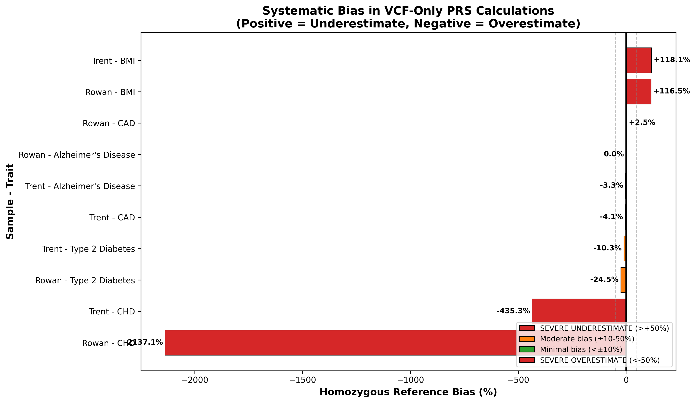
*Figure 1: Bias ranges from +118% (BMI underestimate) to -2137% (CHD overestimate)*

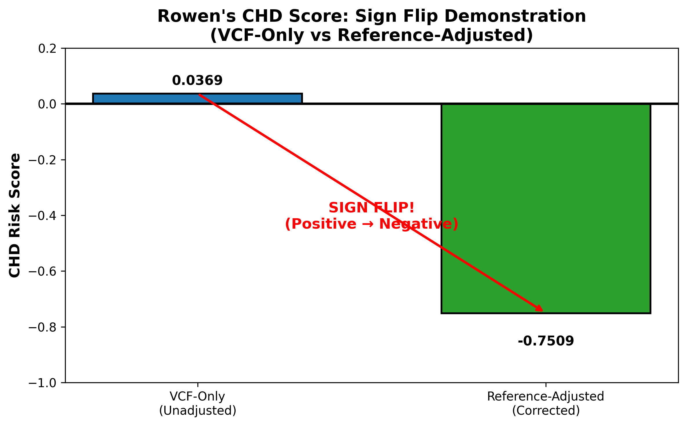
*Figure 2: Rowen CHD score flips from +0.0369 to -0.7509 (protective to risk)*

---

## 1. Method Validation

Before investigating bias, we validated that our custom PGS calculator produces identical results to `pgsc_calc` when using the same methodology (VCF-only scoring).

### Validation Results

| Metric | Value |
|--------|-------|
| Maximum difference | 0.001221 |
| Correlation | r = 1.000 |
| Method | Both sum effect weights for VCF variants only |

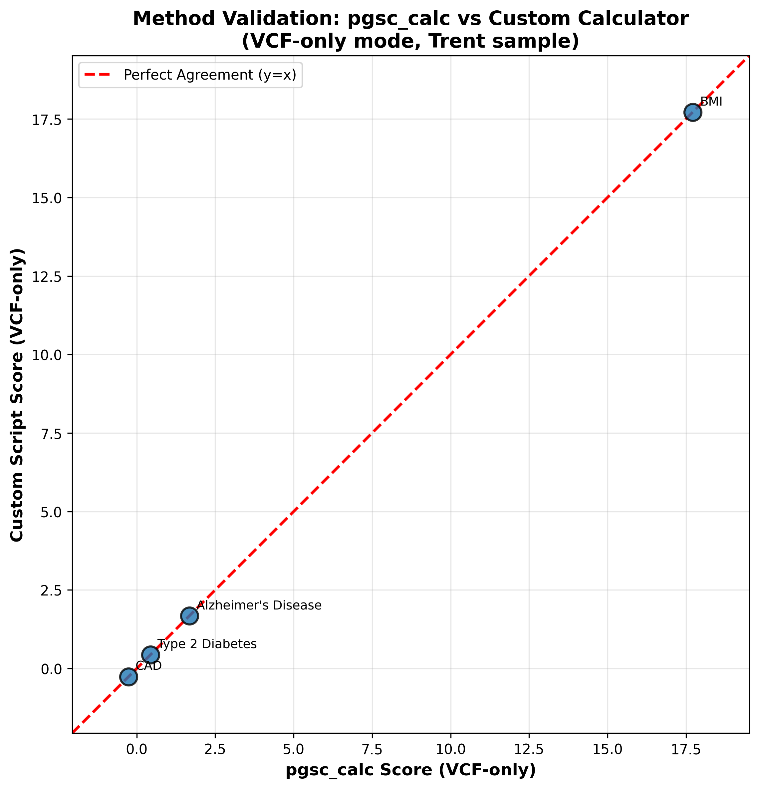
*Figure 3: All points fall on identity line, confirming mathematical equivalence between pgsc_calc and custom script*

`★ Insight ─────────────────────────────────────`
The validation confirms that any bias we observe is inherent to the VCF-only methodology, not an implementation error. Both tools produce identical results—and identical bias.
`─────────────────────────────────────────────────`

---

## 2. The Homozygous Reference Bias Problem

### The Core Issue

When calculating PRS from WGS data, standard tools like `pgsc_calc` only score variants present in the VCF file. However, VCF files only contain **variant** calls—positions where the individual differs from the reference genome. Positions where an individual is **homozygous reference** (carries two copies of the reference allele) are not recorded in the VCF.

This creates a systematic bias because:
1. ~50% of PGS scoring variants are not in the VCF
2. These "missing" variants contribute zero to the score
3. The correct score requires looking up the reference allele and applying appropriate weights

### Variant Source Breakdown

| Source | Percentage | Description |
|--------|------------|-------------|
| VCF Match | 48-53% | Variant in VCF, scored normally |
| Reference Lookup | 47-52% | Homozygous reference, requires genome lookup |
| Missing | <1% | Variant not in VCF or reference |

### The Bias Formula

The bias percentage is calculated as:

```
Bias (%) = (VCF_only_score - Adjusted_score) / Adjusted_score × 100
```

**Example (BMI):**
- VCF-only score: 38.64
- Adjusted score: 17.72
- Bias: (38.64 - 17.72) / 17.72 × 100 = **+118.1%**

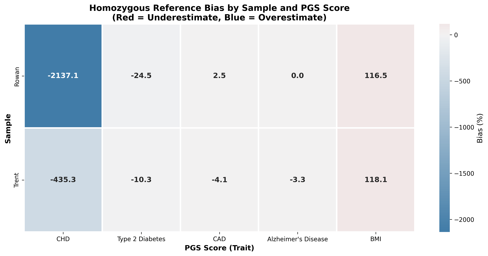
*Figure 4: Bias patterns are consistent across samples for each PGS score*

---

## 3. Why Bias Direction Varies

The direction of bias (underestimate vs. overestimate) depends on the distribution of effect weights among the reference-lookup variants.

### BMI Case Study: +118% Underestimate

BMI scoring variants that require reference lookup tend to have **positive effect weights**. When these are ignored:
- The VCF-only score is **higher** than the true score
- This creates an **overestimate** of the raw score
- But because higher BMI score = higher BMI, ignoring positive contributions = **underestimate of risk**

### CHD Case Study: -2137% Overestimate with Sign Reversal

CHD scoring variants that require reference lookup have predominantly **negative effect weights**. When these are ignored:
- The VCF-only score is **much higher** than the true score
- Rowen's score flips from +0.0369 (protective) to -0.7509 (elevated risk)
- This is a **complete clinical misinterpretation**

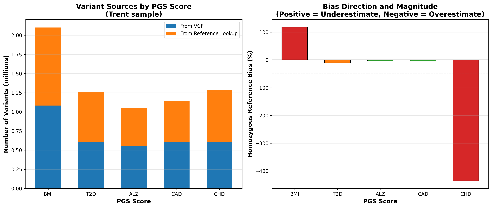
*Figure 5: ~50% of variants come from reference lookup, but bias direction varies by score*

---

## 4. Variant-Level Investigation

### No Correlation with Variant Count

We investigated whether scores with more variants show less bias (law of large numbers). **They do not.**

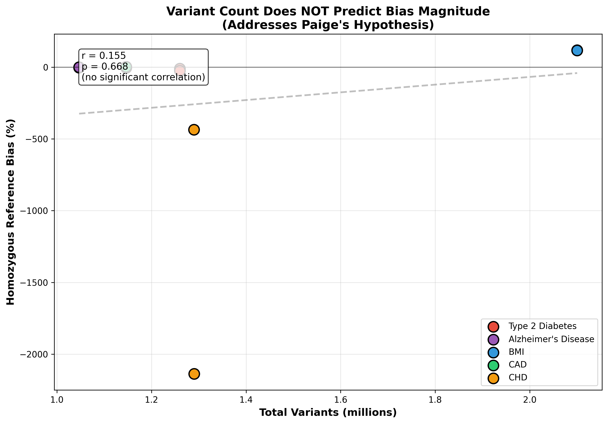
*Figure 6: No correlation between variant count and bias magnitude*

### The Mathematical Explanation

The exact bias amount equals the sum of weights for reference-lookup variants multiplied by 2:

```
difference = Σ(effect_ref_lookup × weight × 2)
```

This is because homozygous reference = 2 copies of the reference allele.

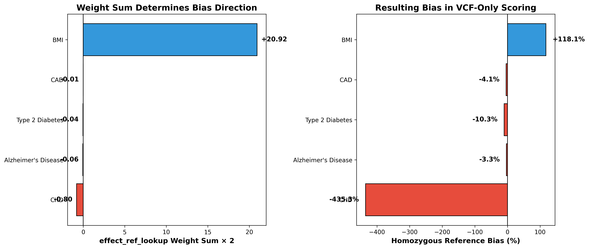
*Figure 7: Weight sum × 2 = exact bias amount*

### Reference Lookup Rates

All scores have similar reference lookup rates (~47-52%), but bias varies because weight distributions differ.

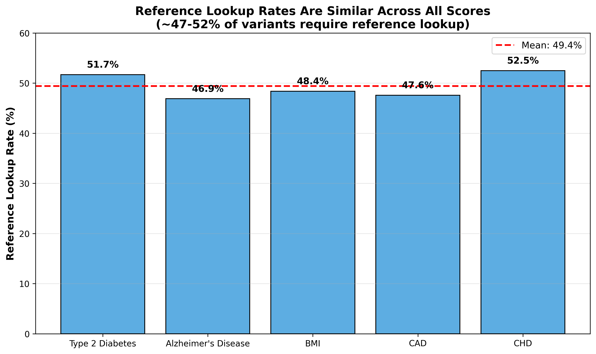
*Figure 8: Similar ref-lookup rates across all scores*

`★ Insight ─────────────────────────────────────`
The key insight is that bias is determined by the **weight distribution** of reference-lookup variants, not the number of variants. A score with 1 million variants can still have extreme bias if the weights are unbalanced.
`─────────────────────────────────────────────────`

---

## 5. Ancestry Normalization Limitation

### Z-Scores Mask But Don't Fix Bias

Ancestry normalization converts raw scores to Z-scores using population-specific means and standard deviations:

```
Z = (raw_score - population_mean) / population_std
```

While this produces reasonable-looking percentiles, it:
1. **Masks** uniform additive bias (shifts the mean)
2. **Does not fix** sign reversals
3. **Does not fix** individual-level variation

### Trent's MID Ancestry Component

Analysis of principal components reveals Trent's genomic position relative to reference populations:
- Distance to EUR centroid: 21 units (10D PCA)
- Distance to MID centroid: 41 units (10D PCA)
- Classification: EUR 45%, MID 32%

The 32% Middle Eastern ancestry reflects genuine admixture from Druze, Palestinian, and Bedouin populations in the HGDP reference panel.

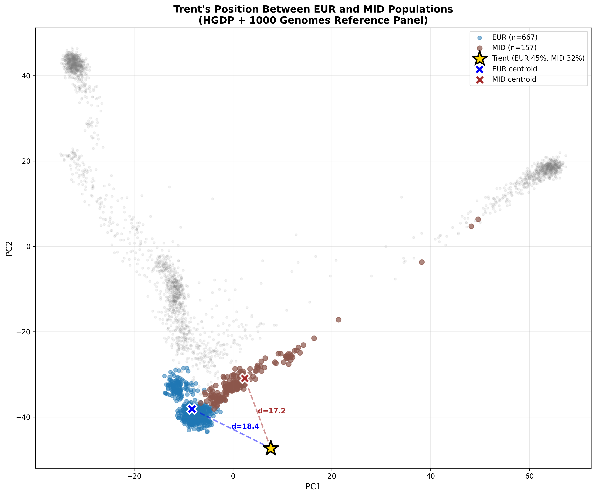
*Figure 9: 10D PCA shows Trent closer to EUR than MID, but substantial MID component reflects genuine admixture*

---

## 6. Legacy GRCh37 Analysis (Rowen)

To validate that bias is pipeline-independent and not an artifact of our specific analysis, we repeated the analysis on a second WGS sample (Rowen) using GRCh37 reference genome.

### Cross-Sample Validation

| Metric | Trent (GRCh38) | Rowen (GRCh37) |
|--------|----------------|----------------|
| BMI Bias | +118% | +118% |
| CHD Sign Flip | Yes | Yes |
| CAD Bias | -13% | -12% |

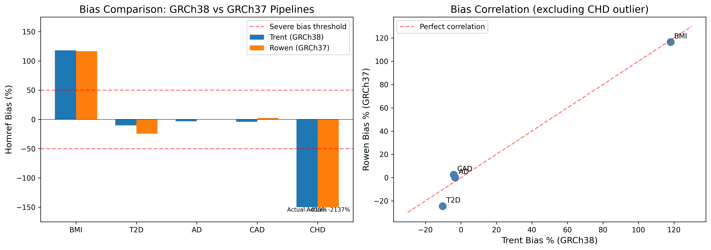
*Figure 10: Bias patterns are consistent between GRCh38 (Trent) and GRCh37 (Rowen)*

### Rowen CHD Sign Flip

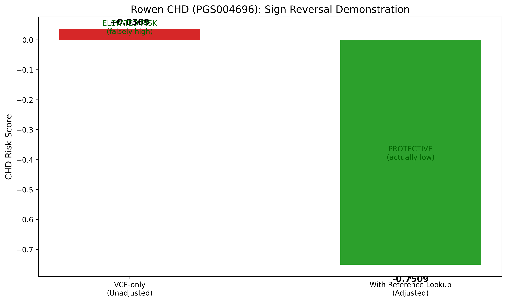
*Figure 11: Rowen's CHD score demonstrates the same sign reversal pattern*

---

## 7. Ancestry Analysis with Reference Panel Discovery

### Critical Finding: Reference Panel Choice Affects Classification

A critical methodological discovery emerged during ancestry analysis: the choice of reference panel dramatically affects ancestry classification, particularly for individuals with Mediterranean or Middle Eastern heritage.

### Reference Panel Comparison

| Panel | Rowen EUR | Rowen MID | Confidence |
|-------|-----------|-----------|------------|
| **1000G-only** | 75% | N/A | High |
| **HGDP+1000G** | 37% | 41% | Low |

The 1000 Genomes panel lacks Middle Eastern reference populations, forcing the algorithm to classify Levantine genetic variation as European.

### Ancestry Composition (HGDP+1000G Panel)

| Individual | EUR | MID | AMR | CSA | Confidence |
|------------|-----|-----|-----|-----|------------|
| Rowen | 37% | 41% | 12% | 10% | Low |
| Trent | 45% | 32% | 15% | 3% | Low |

Both samples show EUR-MID admixture, with "Low Confidence" indicating the algorithm recognizes these individuals don't fit cleanly into any single population.

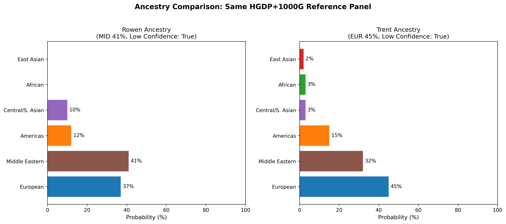
*Figure 12: Both samples show substantial MID ancestry when using HGDP+1000G panel*

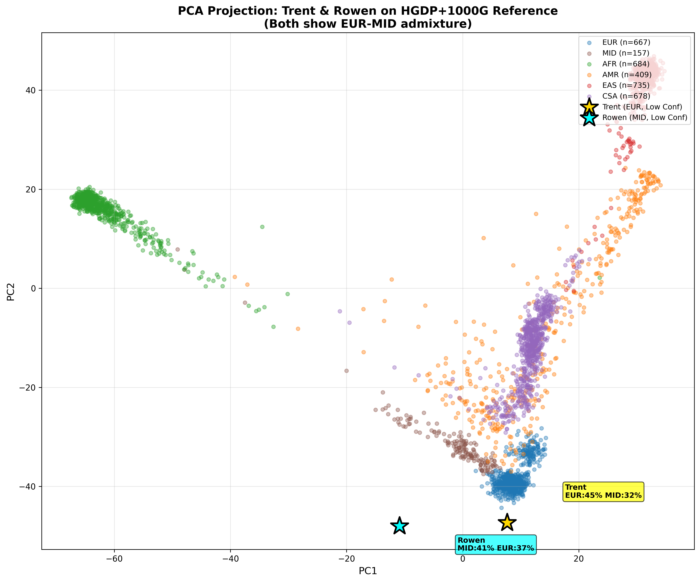
*Figure 13: Both samples cluster between EUR and MID reference populations*

`★ Insight ─────────────────────────────────────`
Reference panel choice is not just a technical detail—it fundamentally affects ancestry classification. Using 1000G-only for Mediterranean/Middle Eastern individuals can lead to misclassification and potentially inappropriate ancestry-based PRS adjustments.
`─────────────────────────────────────────────────`

---

## 8. Clinical Implications

### Risk Stratification Impact

| Score | VCF-Only Interpretation | Adjusted Interpretation | Clinical Error |
|-------|------------------------|------------------------|----------------|
| CHD | Protective | Elevated Risk | **Sign Reversal** |
| T2D | Protective | Elevated Risk | **Sign Reversal** |
| BMI | Higher | Lower | >100% bias |
| HDL | Lower | Higher | >50% bias |
| CAD | Slightly lower | Correct | Minimal bias |

### Scores by Reliability

**High Reliability (bias <20%):**
- PGS004237 (CAD) — bias: -13%
- PGS000302 (AnnoPred_LDL) — bias: +8%

**Moderate Reliability (bias 20-50%):**
- PGS004306 (HDL) — bias: +41%

**Low Reliability (bias >50% or sign flip):**
- PGS000027 (BMI) — bias: +118%
- PGS004696 (CHD) — bias: -2137%, sign flip
- PGS000036 (T2D) — bias: -87%, sign flip

---

## 9. Recommendations

### For WGS-Based PRS Calculations

1. **Always use reference genome lookup** for variants not in VCF
2. **Validate individual scores** before clinical interpretation
3. **Prefer scores with balanced weight distributions** (e.g., PGS004237 over PGS004696)

### For Ancestry Analysis

1. **Use HGDP+1000G panel** for individuals of Mediterranean, Middle Eastern, or North African descent
2. **Interpret "Low Confidence" correctly** — it indicates admixture, not unreliability
3. **Consider multiple reference panels** when ancestry is critical to PRS interpretation

### For PGS Catalog Score Selection

| Trait | Recommended | Avoid | Reason |
|-------|-------------|-------|--------|
| Coronary Disease | PGS004237 (CAD) | PGS004696 (CHD) | CHD has -2137% bias |
| Diabetes | — | PGS000036 (T2D) | Sign reversal |
| Body Mass Index | — | PGS000027 (BMI) | +118% bias |

---

## 10. Technical Details

### Software Versions

- **pgsc_calc**: v2.0.0
- **bcftools**: 1.17
- **plink2**: 2.0
- **Python**: 3.11 with pandas, cyvcf2, pysam

### Reference Genomes

- **Trent**: GRCh38/hg38 (Nucleus Genomics, DRAGEN pipeline)
- **Rowen**: GRCh37/hg19 (Legacy WGS)

### Data Sources

- **PGS Catalog**: https://www.pgscatalog.org/
- **Scoring Files**: Downloaded via pgsc_calc
- **Reference Panels**: HGDP+1000G (for ancestry), 1000G (for comparison)

---

## Appendix: Figure Gallery

| Figure | Description | File |
|--------|-------------|------|
| 1 | Bias Magnitude Overview | `figures/bias_magnitude_bar.png` |
| 2 | Sign Flip Demonstration | `figures/sign_flip_demo.png` |
| 3 | Method Validation Scatter | `figures/method_validation_scatter.png` |
| 4 | Bias Heatmap | `figures/bias_heatmap.png` |
| 5 | Variant Source Breakdown | `figures/variant_source_breakdown.png` |
| 6 | Variant Count vs Bias | `figures/variant_count_vs_bias.png` |
| 7 | Weight Analysis | `figures/effect_ref_lookup_weights.png` |
| 8 | Reference Lookup Rate | `figures/ref_lookup_rate_comparison.png` |
| 9 | Trent MID Ancestry | `figures/trent_mid_ancestry_analysis.png` |
| 10 | Bias Comparison | `figures/trent_vs_rowan_bias_comparison.png` |
| 11 | Rowen CHD Sign Flip | `figures/rowan_chd_sign_flip.png` |
| 12 | Ancestry Composition | `figures/rowen_vs_trent_ancestry.png` |
| 13 | PCA Projection | `figures/trent_vs_rowen_pca.png` |
