# PRS Methodology Comparison

## Overview

This document compares two approaches to calculating Polygenic Risk Scores (PRS):

1. **Custom Python Script** (`proper_pgs_calculator_v18.py`) - A transparent, educational implementation
2. **pgsc_calc Pipeline** - The PGS Catalog's official Nextflow pipeline (our production approach)

Both approaches calculate PRS by summing weighted effect alleles, but differ significantly in how they handle missing variants, ancestry normalization, and output interpretation.

---

## Architecture Comparison

| Aspect | Custom Script (v18) | pgsc_calc Pipeline |
|--------|--------------------|--------------------|
| **Implementation** | Single Python script (~450 lines) | Nextflow pipeline with PLINK2 |
| **Reference Genome** | GRCh37 (hg19) | GRCh38 (hg38) with automatic liftover |
| **Missing Variants** | Reference genome lookup | Statistical imputation via reference panel |
| **Normalization** | None (raw scores only) | Ancestry-normalized via HGDP+1kGP |
| **Reference Panel** | None | ~3,200 samples from HGDP+1kGP |
| **Output Format** | TSV with per-variant contributions | Interactive HTML + CSV + ancestry PCA |
| **Multi-trait** | Single PGS per run | Multiple PGS scores simultaneously |

---

## Visual Workflow Comparison

### Custom Script (`pgs_calculator.py`)


### pgsc_calc Pipeline

```mermaid
flowchart TB
    subgraph INPUTS["📥 INPUTS"]
        PLINK["PLINK2 Files<br/>(pgen/pvar/psam)"]
        SHEET["Samplesheet.csv"]
        CONFIG["nextflow.config"]
        REFPANEL["Reference Panel<br/>(HGDP+1kGP)"]
    end

    subgraph STAGE1["Stage 1: Setup"]
        VALIDATE["Validate samplesheet"]
        DOWNLOAD["Download PGS files<br/>from Catalog FTP"]
    end

    subgraph STAGE2["Stage 2: Variant Matching"]
        MATCH["Map sample variants<br/>to PGS variants"]
        COVERAGE["Report coverage %"]
    end

    subgraph STAGE3["Stage 3: Harmonization"]
        STRAND["Check allele strand"]
        FLIP["Flip alleles if needed"]
        IMPUTE["Handle missing variants"]
    end

    subgraph STAGE4["Stage 4: PGS Calculation"]
        CALC_PGS["Score = Σ(weight × dosage)"]
        CONTRIB["Generate per-variant<br/>contributions"]
    end

    subgraph STAGE5["Stage 5: Ancestry Analysis"]
        PCA["PCA projection onto<br/>reference panel"]
        ASSIGN["Assign to nearest<br/>superpopulation"]
        RF["Calculate RF probabilities<br/>(EUR, AFR, EAS, etc.)"]
    end

    subgraph STAGE6["Stage 6: Normalization"]
        ZSCORE["Calculate Z-scores<br/>vs assigned population"]
        PCTILE["Convert to percentiles"]
    end

    subgraph OUTPUTS["📤 OUTPUTS"]
        PGS_OUT["pgs.txt.gz<br/>(raw + normalized scores)"]
        POP_OUT["popsimilarity.txt.gz<br/>(ancestry analysis)"]
        REPORT["report.html<br/>(interactive viz)"]
        AGG["aggregated_scores.txt.gz"]
    end

    PLINK --> STAGE1
    SHEET --> VALIDATE
    CONFIG --> VALIDATE

    VALIDATE --> DOWNLOAD
    DOWNLOAD --> MATCH
    MATCH --> COVERAGE
    COVERAGE --> STRAND
    STRAND --> FLIP
    FLIP --> IMPUTE
    IMPUTE --> CALC_PGS
    CALC_PGS --> CONTRIB

    REFPANEL --> PCA
    CONTRIB --> PCA
    PCA --> ASSIGN
    ASSIGN --> RF
    RF --> ZSCORE
    ZSCORE --> PCTILE

    PCTILE --> PGS_OUT
    PCTILE --> POP_OUT
    PCTILE --> REPORT
    PCTILE --> AGG

    style INPUTS fill:#e1f5fe
    style STAGE5 fill:#f3e5f5
    style OUTPUTS fill:#e8f5e9
```



### Key Differences Visualized

| Aspect | Custom Script | pgsc_calc |
|--------|---------------|-----------|
| **Flow Complexity** | 6 sequential steps | 7 parallel-capable stages |
| **Missing Variants** | Reference genome lookup | Statistical imputation |
| **Ancestry Handling** | None | Full PCA + normalization |
| **Output Granularity** | Per-variant TSV | Aggregated + normalized |

---

## Handling Missing Variants

This is the most critical difference between the approaches.

### The Problem

VCF files only store **variants** (positions where the sample differs from reference). If a PGS scoring file contains 1 million variants but your VCF only has 100,000 matching positions, what do you assume for the other 900,000?

### Custom Script Approach

```
Position NOT in VCF
    → Look up reference allele from FASTA
    → Assume homozygous reference (0/0)
    → If effect_allele == reference: dosage = 2
    → If effect_allele != reference: dosage = 0
```

**Pros:**
- Conceptually correct: if no variant called, you have the reference
- Transparent and traceable
- Works offline with local reference genome

**Cons:**
- Requires ~3GB RAM to load chromosome sequences
- No population context for score interpretation
- Assumes perfect variant calling (no false negatives)

### pgsc_calc Approach

```
Position NOT in VCF
    → Use reference panel allele frequencies
    → Statistical imputation based on LD structure
    → Account for ancestry-specific patterns
```

**Pros:**
- Accounts for population-specific allele frequencies
- More robust to variant calling differences
- Provides normalized scores with population context

**Cons:**
- "Black box" - less transparent
- Requires reference panel download (~15GB)
- Computationally intensive

---

## Ancestry Normalization

### Why It Matters

A raw PRS of 0.436 for Type 2 Diabetes is meaningless without context. Is that high? Low? Average?

### Custom Script Output

```
YOUR POLYGENIC SCORE: 0.4367
```

No interpretation possible without external reference data.

### pgsc_calc Output

```
Trait: Type 2 Diabetes
Raw Score: 0.436
Z-Score: +2.76 (standard deviations above mean)
Percentile: 99.7% (among Europeans)
Interpretation: Very High Genetic Risk
```

The same raw score becomes clinically interpretable through normalization against ancestry-matched reference samples.

### Population Similarity Analysis

pgsc_calc also provides ancestry decomposition:

| Population | Probability |
|------------|-------------|
| EUR (European) | 45% |
| MID (Middle Eastern) | 32% |
| AMR (American) | 15% |
| AFR (African) | 3% |
| CSA (Central/South Asian) | 3% |
| EAS (East Asian) | 2% |

This enables appropriate reference population selection for normalization.

---

## Reference Genome Compatibility

### Critical Issue

The custom script downloads GRCh37-harmonized scoring files:

```python
url = f"https://ftp.ebi.ac.uk/pub/databases/spot/pgs/scores/{pgs_id}/ScoringFiles/Harmonized/{pgs_id}_hmPOS_GRCh37.txt.gz"
```

Our Nucleus Genomics data is aligned to **GRCh38**:

```
Reference Genome: GRCh38/hg38 (alt-masked graph v2)
Pipeline: Illumina DRAGEN v05.121.645
```

**Running the custom script on GRCh38 data would produce incorrect results** due to coordinate mismatch. Chromosome positions differ between builds by thousands to millions of base pairs.

pgsc_calc handles this automatically through coordinate liftover.

---

## Memory and Performance

### Custom Script

```python
# Loads entire chromosomes into memory
sequences[current_chr] = ''.join(current_seq)  # ~3GB RAM

# Loads entire VCF into dictionary
vcf_variants[(chrom, pos)] = {...}  # All 5.3M variants
```

- Memory: ~6-8GB for typical WGS
- Runtime: Minutes (single-threaded Python)
- Scalability: Limited to single samples

### pgsc_calc

- Memory: Managed by Nextflow, streams data
- Runtime: Parallelized across available cores
- Scalability: Designed for biobank-scale (100K+ samples)

---

## Output Comparison

### Custom Script Output

```
chr  pos       rsID        ref  alt  genotype  effect_allele  source      dosage  weight    contribution
1    1234567   rs12345     A    G    A/G       G              vcf         1       0.0234    0.0234
1    2345678   rs23456     C    T    C/C       T              ref_lookup  0       0.0156    0.0000
...
```

**Advantages:**
- Every variant contribution visible
- Source tracking (VCF vs reference lookup)
- Excellent for debugging and education

### pgsc_calc Output

1. **Interactive HTML report** with:
   - Ancestry PCA visualization
   - Score distributions
   - Expandable data tables

2. **Summary CSVs:**
   - `prs_normalized_ancestry.csv` - Z-scores and percentiles
   - `pop_summary.csv` - Population similarity

3. **Full data files:**
   - `trent_pgs.txt.gz` - All scores with reference samples
   - `trent_popsimilarity.txt.gz` - Detailed ancestry analysis

---

## When to Use Each Approach

| Use Case | Recommended Approach |
|----------|---------------------|
| Learning how PRS works | Custom script |
| Debugging specific variants | Custom script |
| Clinical interpretation | pgsc_calc |
| Publication-quality analysis | pgsc_calc |
| GRCh37 legacy data | Custom script (with caution) |
| GRCh38 modern WGS | pgsc_calc |
| Mixed ancestry samples | pgsc_calc |
| Quick single-trait check | Custom script |
| Multi-trait analysis | pgsc_calc |

---

## Our Implementation Choice

For this project, we chose **pgsc_calc** because:

1. **Genome build match**: Our Nucleus data is GRCh38
2. **Ancestry normalization**: Essential for clinical interpretation
3. **Reference panel**: HGDP+1kGP provides robust population context
4. **Reproducibility**: Official PGS Catalog tool with versioned releases
5. **Output quality**: Interactive HTML reports are shareable and interpretable

---

## Key Insights

### The "Missing Variant" Problem

Both approaches correctly recognize that VCF files only store variants. The difference is in how they handle the majority of PGS positions that won't appear in a typical VCF:

- **Custom script**: Binary assumption (you have reference or you don't)
- **pgsc_calc**: Probabilistic approach using population genetics

### Raw Scores Are Meaningless Alone

A T2D PRS of 0.436 only becomes actionable when contextualized as "99.7th percentile among Europeans." This transformation from raw score to interpretable percentile is the primary value of ancestry normalization.

### Transparency vs. Accuracy Trade-off

The custom script offers complete transparency at the cost of some accuracy. pgsc_calc provides more accurate normalized scores but operates as more of a "black box." For research and clinical applications, the accuracy gain is worth the transparency cost.

---

## PGS Quality Validation Findings

Based on validation work by Lee Rowen (January 2026), not all PGS Catalog scores are equally trustworthy.

### The Problem

When Lee systematically evaluated 7 coronary artery disease (CAD) PGS scores, **only ~2 of 7 were clearly trustworthy**. The field has quality control issues that aren't immediately apparent.

### Validation Techniques

#### 1. REF/ALT Ratio Checking

Suspicious scores often have unusual ratios of effect alleles being REF vs ALT:

```
Trustworthy PGS: ~50% effect allele = ALT, ~50% effect allele = REF
Suspicious PGS:  >80% effect allele = ALT (or vice versa)
```

A heavily skewed ratio suggests the score may have been created with inconsistent allele coding.

#### 2. Biology Direction Validation

For well-understood genetics, verify the score matches expected biology:

| Gene | Expected Direction | Validation |
|------|-------------------|------------|
| APOE ε4 | Increases AD risk | Score should show positive weight for ε4 |
| ADH1B*2 | Decreases alcoholism risk | Score should show protective effect |
| BRCA1 pathogenic | Increases cancer risk | Score should show increased risk |

If a score shows APOE ε4 as protective, something is wrong with the scoring file.

#### 3. Coding Scheme Identification

Different PGS scores use different conventions:

| Convention | Effect Allele | Interpretation |
|------------|---------------|----------------|
| Risk allele coding | Higher = more risk | Most intuitive |
| Effect allele coding | May be protective or risk | Check sign carefully |
| Odds ratio direction | >1 = increased risk | Log-transform for comparison |

This makes comparing raw scores across different PGS IDs treacherous.

### Recommendations

1. **Don't blindly trust PGS Catalog scores** - validate before clinical interpretation
2. **Check REF/ALT ratios** in scoring files as a quality signal
3. **Verify biology direction** for known high-impact variants
4. **Use multiple PGS for same trait** and check for concordance
5. **Prefer LD-aware methods** (LDpred, PRS-CS) over simple clumping+thresholding
6. **Read the original paper** - PGS Catalog is a repository, not a validation authority

### Implications

The PRS field is **not ready for clinical prime time** without careful validation. For personal genomics projects:

- Treat PRS results as hypothesis-generating, not diagnostic
- Focus on well-validated scores from large consortium studies
- Cross-reference with known high-penetrance variants (APOE, BRCA, etc.)
- Consider effect sizes - even "high risk" PRS may have modest clinical impact

---

## References

- [PGS Catalog](https://www.pgscatalog.org/)
- [pgsc_calc Documentation](https://pgsc-calc.readthedocs.io/)
- [HGDP+1kGP Reference Panel](https://www.internationalgenome.org/)
- [GRCh38 vs GRCh37 Differences](https://www.ncbi.nlm.nih.gov/grc/human)
- [pgsc_calc Quickstart Guide](PGSC_CALC_QUICKSTART.md) - Single VCF workflow
